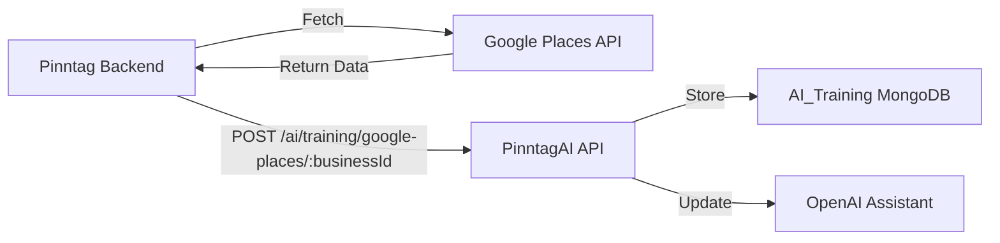

# Google Places API Integration

## Overview

This feature integrates Google Places API data into the AI training system, enriching the AI assistant's knowledge with verified business information including operating hours, location, ratings, photos, and more.

## Changes Made

### 1. Removed `operating_hours` Question

The `operating_hours` question has been removed from the questionnaire ([AI_Training_questionnaire.ts](src/utils/AI_Training_questionnaire.ts)) since this data will be automatically fetched from Google Places API.

### 2. New Data Model

#### Google Places Data Interface ([AI_Training.model.ts:9-49](src/models/AI_Training.model.ts#L9-L49))

```typescript
export interface IGooglePlacesData {
  regularOpeningHours?: {
    openNow?: boolean;
    periods?: Array<{
      open: { day: number; hour: number; minute: number };
      close: { day: number; hour: number; minute: number };
    }>;
    weekdayDescriptions?: string[];
  };
  photos?: Array<{
    name: string;
    widthPx: number;
    heightPx: number;
    authorAttributions?: Array<{
      displayName: string;
      uri: string;
      photoUri: string;
    }>;
  }>;
  rating?: number;
  userRatingCount?: number;
  googleMapsUri?: string;
  websiteUri?: string;
  nationalPhoneNumber?: string;
  internationalPhoneNumber?: string;
  formattedAddress?: string;
  location?: {
    latitude: number;
    longitude: number;
  };
  types?: string[];
  displayName?: {
    text: string;
    languageCode: string;
  };
  primaryTypeDisplayName?: {
    text: string;
    languageCode: string;
  };
  lastUpdated?: Date;
}
```

#### Updated AI_Training Model

The `IAI_Training` interface now includes:

```typescript
export interface IAI_Training {
  // ... existing fields
  googlePlacesData?: IGooglePlacesData;
  // ... rest of fields
}
```

### 3. New API Endpoint

**Endpoint**: `POST /ai/training/google-places/:businessId`

**Purpose**: Receives Google Places API data from Pinntag backend and stores it in the training record.

**Authentication**: Requires internal API key (`x-internal-api-key` header)

**Request**:
```http
POST /ai/training/google-places/68e4c33ae82970cefe8ff1b7
Content-Type: application/json
x-internal-api-key: change-me

{
  "regularOpeningHours": {
    "openNow": true,
    "periods": [
      {
        "open": { "day": 0, "hour": 12, "minute": 0 },
        "close": { "day": 1, "hour": 2, "minute": 0 }
      }
    ],
    "weekdayDescriptions": [
      "Monday: 12:00 PM – 2:00 AM",
      "Tuesday: 12:00 PM – 2:00 AM",
      "Wednesday: 12:00 PM – 2:00 AM",
      "Thursday: 12:00 PM – 2:00 AM",
      "Friday: 12:00 PM – 2:00 AM",
      "Saturday: 12:00 PM – 2:00 AM",
      "Sunday: 12:00 PM – 2:00 AM"
    ]
  },
  "photos": [
    {
      "name": "places/ChIJb8CdF...",
      "widthPx": 4800,
      "heightPx": 3200,
      "authorAttributions": [...]
    }
  ],
  "rating": 4,
  "userRatingCount": 2062,
  "googleMapsUri": "https://maps.google.com/?cid=17805946038053451664",
  "websiteUri": "https://woodys.com/",
  "nationalPhoneNumber": "(323) 654-0396",
  "internationalPhoneNumber": "+1 323-654-0396",
  "formattedAddress": "8852 Santa Monica Blvd, West Hollywood, CA 90069, USA",
  "location": {
    "latitude": 34.088777799999995,
    "longitude": -118.38725899999999
  },
  "types": ["restaurant", "bar", "food", "point_of_interest", "establishment"],
  "displayName": {
    "text": "Woody's",
    "languageCode": "en"
  },
  "primaryTypeDisplayName": {
    "text": "Bar",
    "languageCode": "en"
  }
}
```

**Success Response**:
```json
{
  "success": true,
  "data": {
    "message": "Google Places data updated successfully",
    "training": {
      "businessId": "68e4c33ae82970cefe8ff1b7",
      "googlePlacesData": {
        "regularOpeningHours": { ... },
        "rating": 4,
        "userRatingCount": 2062,
        "formattedAddress": "8852 Santa Monica Blvd, West Hollywood, CA 90069, USA",
        "lastUpdated": "2025-12-05T10:30:00.000Z"
      },
      "lastUpdated": "2025-12-05T10:30:00.000Z"
    }
  }
}
```

**Error Responses**:

```json
// Missing businessId
{
  "success": false,
  "error": "Business ID is required"
}

// Invalid businessId format
{
  "success": false,
  "error": "Invalid Business ID format"
}

// Training record not found
{
  "success": false,
  "error": "Training record not found for this business"
}

// Empty request body
{
  "success": false,
  "error": "Google Places data is required in request body"
}
```

### 4. Service Implementation

**Location**: [aiTraining.service.ts:1399-1517](src/api/services/aiTraining.service.ts#L1399-L1517)

**Method**: `AITrainingService.updateGooglePlacesData()`

**Features**:
- Validates businessId format
- Finds existing training record
- Structures and stores Google Places data
- **Automatic AI Assistant Update**: If training is completed, automatically updates the AI assistant with enriched instructions including Google Places data
- **Graceful Error Handling**: Data is saved even if assistant update fails
- Comprehensive logging for debugging

### 5. Enhanced AI Instructions

**New Helper Function**: `generateEnhancedInstructionsWithGooglePlaces()`

**Location**: [aiTraining.service.ts:200-409](src/api/services/aiTraining.service.ts#L200-L409)

This function generates AI assistant instructions that include:

#### Business Overview Section
- Business name and industry
- **Location**: Full formatted address
- **Google Maps link**: Direct link to business on Google Maps
- **Customer rating**: e.g., "4/5 (2062 reviews)"
- **Business categories**: From Google Places types
- **Website**: If available from Google Places
- **Phone number**: National phone number

#### Operating Hours Section
- **Weekday descriptions**: e.g., "Monday: 12:00 PM – 2:00 AM"
- **Current status**: "Currently: OPEN" or "Currently: CLOSED"
- Formatted from Google Places `regularOpeningHours`

#### Enhanced AI Capabilities

The AI assistant can now:

1. **Suggest time-sensitive deals** based on actual operating hours
2. **Reference the business location** in marketing content
3. **Leverage customer ratings** as social proof
4. **Provide accurate hours** when customers ask
5. **Create location-aware campaigns**
6. **Use verified business data** for recommendations

## API Integration Flow

### From Pinntag Backend



### Example Integration Code

```javascript
// Pinntag Backend - Fetch and send Google Places data
async function updateBusinessGooglePlacesData(businessId, placeId) {
  // 1. Fetch from Google Places API
  const googlePlacesData = await fetchGooglePlacesData(placeId);

  // 2. Send to PinntagAI
  const response = await fetch(
    `${PINNTAG_AI_URL}/ai/training/google-places/${businessId}`,
    {
      method: 'POST',
      headers: {
        'Content-Type': 'application/json',
        'x-internal-api-key': INTERNAL_API_KEY,
      },
      body: JSON.stringify(googlePlacesData),
    }
  );

  const result = await response.json();

  if (result.success) {
    console.log('Google Places data updated successfully');
    console.log('Last updated:', result.data.training.lastUpdated);
  } else {
    console.error('Failed to update:', result.error);
  }
}
```

## When to Call This API

### Recommended Triggers

1. **Business Onboarding**: When a new business signs up and completes training
2. **Periodic Updates**: Schedule updates every 30 days to keep data fresh
3. **Manual Refresh**: When business owner requests to update their information
4. **After Training Completion**: Immediately after `/complete` API is called

### Best Practices

```javascript
// Example: Update after training completion
async function completeTrainingWorkflow(businessId) {
  // 1. Complete training
  await fetch(`${PINNTAG_AI_URL}/ai/training/complete/${businessId}`, {
    headers: { 'x-internal-api-key': API_KEY }
  });

  // 2. Fetch Google Places data
  const placeId = await getPlaceIdForBusiness(businessId);
  const googleData = await fetchGooglePlacesData(placeId);

  // 3. Update with Google Places data
  await fetch(`${PINNTAG_AI_URL}/ai/training/google-places/${businessId}`, {
    method: 'POST',
    headers: {
      'Content-Type': 'application/json',
      'x-internal-api-key': API_KEY
    },
    body: JSON.stringify(googleData)
  });
}
```

## Data Storage

### MongoDB Structure

```javascript
{
  "_id": ObjectId("..."),
  "businessId": ObjectId("68e4c33ae82970cefe8ff1b7"),
  "assistantId": "asst_xyz123",
  "industry": "Food & Drink",
  "subCategory": "Bar",
  "responses": [...],
  "trainingStatus": "completed",
  "currentPhase": "basic",
  "googlePlacesData": {
    "regularOpeningHours": {
      "openNow": true,
      "periods": [...],
      "weekdayDescriptions": [...]
    },
    "photos": [...],
    "rating": 4,
    "userRatingCount": 2062,
    "googleMapsUri": "https://maps.google.com/?cid=...",
    "websiteUri": "https://woodys.com/",
    "nationalPhoneNumber": "(323) 654-0396",
    "formattedAddress": "8852 Santa Monica Blvd, West Hollywood, CA 90069, USA",
    "location": {
      "latitude": 34.088777799999995,
      "longitude": -118.38725899999999
    },
    "types": ["restaurant", "bar", "food"],
    "displayName": {
      "text": "Woody's",
      "languageCode": "en"
    },
    "lastUpdated": ISODate("2025-12-05T10:30:00.000Z")
  },
  "lastUpdated": ISODate("2025-12-05T10:30:00.000Z"),
  "createdAt": ISODate("2025-11-01T08:00:00.000Z"),
  "updatedAt": ISODate("2025-12-05T10:30:00.000Z")
}
```

## Benefits

### 1. Accurate Business Information
- No manual entry errors for operating hours
- Verified location and contact information
- Real customer ratings and review counts

### 2. Reduced User Friction
- One less question in the questionnaire
- Faster onboarding process
- Automatic data updates

### 3. Enhanced AI Capabilities
- Location-aware marketing recommendations
- Time-based deal suggestions using actual hours
- Social proof from real ratings
- More personalized content

### 4. Data Freshness
- Can be updated independently of training
- Automatic sync with Google's verified data
- Timestamp tracking for data age

## Monitoring

### Logs to Watch

```bash
# Successful update
INFO: Updating Google Places data
  businessId: "68e4c33ae82970cefe8ff1b7"

INFO: Google Places data updated successfully
  businessId: "68e4c33ae82970cefe8ff1b7"
  hasOpeningHours: true

INFO: Assistant updated with Google Places data
  businessId: "68e4c33ae82970cefe8ff1b7"
  assistantId: "asst_xyz123"
```

```bash
# Failed assistant update (data still saved)
ERROR: Failed to update assistant with Google Places data, but data was saved
  error: { ... }
  businessId: "68e4c33ae82970cefe8ff1b7"
```

### Monitoring Queries

```javascript
// Check businesses with Google Places data
db.ai_training.countDocuments({ googlePlacesData: { $exists: true } })

// Find businesses missing Google Places data
db.ai_training.find({
  trainingStatus: "completed",
  googlePlacesData: { $exists: false }
})

// Find stale Google Places data (older than 30 days)
db.ai_training.find({
  "googlePlacesData.lastUpdated": {
    $lt: new Date(Date.now() - 30 * 24 * 60 * 60 * 1000)
  }
})
```

## Testing

### Test the API Endpoint

```bash
# Test successful update
curl --location 'localhost:4001/ai/training/google-places/68e4c33ae82970cefe8ff1b7' \
--header 'x-internal-api-key: change-me' \
--header 'Content-Type: application/json' \
--data '{
  "regularOpeningHours": {
    "openNow": true,
    "weekdayDescriptions": [
      "Monday: 9:00 AM – 5:00 PM",
      "Tuesday: 9:00 AM – 5:00 PM",
      "Wednesday: 9:00 AM – 5:00 PM",
      "Thursday: 9:00 AM – 5:00 PM",
      "Friday: 9:00 AM – 5:00 PM",
      "Saturday: Closed",
      "Sunday: Closed"
    ]
  },
  "rating": 4.5,
  "userRatingCount": 150,
  "formattedAddress": "123 Main St, San Francisco, CA 94102, USA",
  "googleMapsUri": "https://maps.google.com/?cid=123456789",
  "nationalPhoneNumber": "(415) 555-1234"
}'

# Test invalid businessId
curl --location 'localhost:4001/ai/training/google-places/invalid-id' \
--header 'x-internal-api-key: change-me' \
--header 'Content-Type: application/json' \
--data '{}'

# Test missing request body
curl --location 'localhost:4001/ai/training/google-places/68e4c33ae82970cefe8ff1b7' \
--header 'x-internal-api-key: change-me' \
--header 'Content-Type: application/json' \
--data '{}'
```

### Verify AI Assistant Update

```bash
# 1. Update Google Places data
curl --location 'localhost:4001/ai/training/google-places/68e4c33ae82970cefe8ff1b7' \
--header 'x-internal-api-key: change-me' \
--header 'Content-Type: application/json' \
--data @google_places_response.json

# 2. Check training state (should include Google Places data)
curl --location 'localhost:4001/ai/training/state/68e4c33ae82970cefe8ff1b7' \
--header 'x-internal-api-key: change-me'

# 3. Test AI assistant (should reference location, hours, rating)
# Make a chat request to the assistant and verify it mentions the updated data
```

## Migration Notes

### No Database Migration Required

The `googlePlacesData` field is optional, so existing training records will continue to work without it. The field can be added by calling the new API endpoint.

### Backward Compatibility

- Existing questionnaire responses are preserved
- AI assistant instructions are enhanced, not replaced
- If Google Places data is not available, AI falls back to questionnaire data

## Files Modified

1. **[AI_Training_questionnaire.ts](src/utils/AI_Training_questionnaire.ts)**
   - Removed `operating_hours` question

2. **[AI_Training.model.ts:9-49](src/models/AI_Training.model.ts#L9-L49)**
   - Added `IGooglePlacesData` interface
   - Added `googlePlacesData` field to `IAI_Training`
   - Added schema field for `googlePlacesData`

3. **[aiTraining.service.ts:200-409](src/api/services/aiTraining.service.ts#L200-L409)**
   - Added `generateEnhancedInstructionsWithGooglePlaces()` helper function

4. **[aiTraining.service.ts:1399-1517](src/api/services/aiTraining.service.ts#L1399-L1517)**
   - Added `updateGooglePlacesData()` service method

5. **[aiTrainingController.ts:588-648](src/api/controllers/aiTrainingController.ts#L588-L648)**
   - Added `updateGooglePlacesData()` controller method

6. **[aiTraining.routes.ts:82-88](src/api/routes/aiTraining.routes.ts#L82-L88)**
   - Added POST `/ai/training/google-places/:businessId` route

## Future Enhancements

### Potential Features

1. **Photo Management**: Allow selecting primary photo from Google Places photos
2. **Review Highlights**: Extract and store top customer reviews
3. **Business Attributes**: Store additional attributes like price level, accessibility
4. **Competitive Analysis**: Compare ratings/reviews with nearby businesses
5. **Trend Tracking**: Monitor rating changes over time
6. **Menu Integration**: If available from Google Places, integrate menu data

### Automatic Updates

Consider implementing a scheduled job to refresh Google Places data:

```javascript
// Pseudo-code for scheduled update
async function refreshGooglePlacesData() {
  const businesses = await AI_TrainingModel.find({
    trainingStatus: "completed",
    $or: [
      { "googlePlacesData.lastUpdated": { $exists: false } },
      { "googlePlacesData.lastUpdated": { $lt: thirtyDaysAgo } }
    ]
  });

  for (const business of businesses) {
    const placeId = await getPlaceIdForBusiness(business.businessId);
    const googleData = await fetchGooglePlacesData(placeId);
    await updateGooglePlacesDataAPI(business.businessId, googleData);
  }
}

// Run daily
cron.schedule('0 2 * * *', refreshGooglePlacesData);
```

## Summary

The Google Places integration:
- ✅ Removes manual `operating_hours` question
- ✅ Automatically enriches training data with verified information
- ✅ Updates AI assistant with location-aware capabilities
- ✅ Maintains data freshness with timestamp tracking
- ✅ Handles errors gracefully
- ✅ No breaking changes or migrations required
- ✅ Ready for production deployment

---

**Version:** 1.0
**Last Updated:** 2025-12-05
**Status:** ✅ Implemented and Ready for Integration
