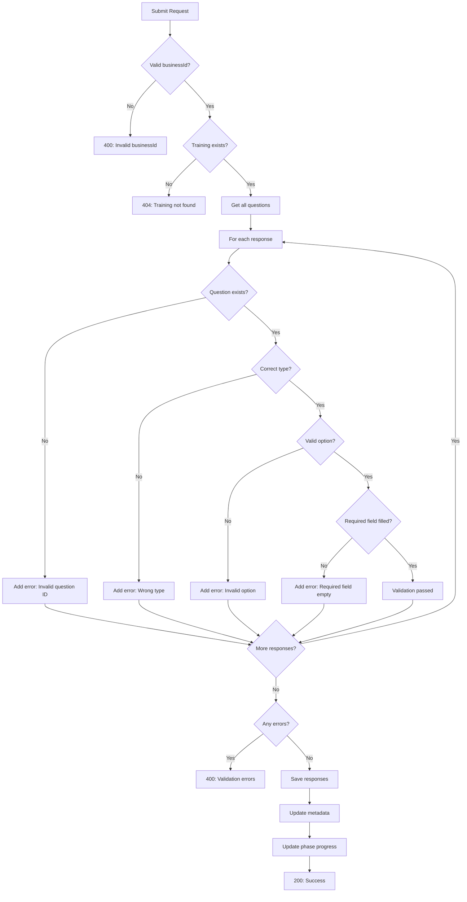

# Submit API Validation

## Overview
The submit training responses API now includes comprehensive validation to ensure data integrity and proper answer formatting.

## Endpoint
```
POST /ai/training/submit
```

## Validation Features

### 1. Question ID Validation
- **Validates**: Question ID exists in the questionnaire for the business's industry/subCategory
- **Error**: `"Question ID 'xyz' does not exist for this business"`

### 2. Answer Type Validation
Ensures answer type matches the question type:

| Question Type | Expected Answer Type | Validation |
|--------------|---------------------|------------|
| `text` | `string` | Must be a string |
| `multiple_choice` | `string` | Must be a single string, not array |
| `multi_select` | `string[]` | Must be an array of strings |
| `number` | `number` | Must be a valid number (not NaN) |
| `boolean` | `boolean` | Must be true or false |
| `time` | `string` | Must be in HH:MM format |

### 3. Options Validation
For `multiple_choice` and `multi_select` questions:
- **Validates**: Selected option(s) are from the valid options list
- **Error**: `"Answer 'XYZ' is not a valid option for question: abc. Valid options: A, B, C"`

### 4. Required Field Validation
For required questions:
- **Text**: Cannot be empty or whitespace-only string
- **Multi-select**: Must have at least one selection
- **All types**: Answer cannot be null or undefined

### 5. Format Validation
- **Time questions**: Must match HH:MM format (e.g., "09:00", "14:30")
- **Number questions**: Must be a valid number, not NaN

### 6. Metadata Updates
After successful validation and saving:
- Updates `answeredQuestions` count
- Recalculates `completionPercentage`
- Updates `phaseProgress` for each phase
- Marks phase as completed when all questions in that phase are answered
- Updates `trainingStatus` from "not_started" to "in_progress"

## Request Examples

### Valid Requests

#### Text Question
```json
{
  "businessId": "64f1a2b3c4d5e6f7g8h9i0j1",
  "responses": [
    {
      "questionId": "business_name",
      "answer": "Joe's Coffee Shop"
    }
  ]
}
```

#### Multiple Choice Question
```json
{
  "businessId": "64f1a2b3c4d5e6f7g8h9i0j1",
  "responses": [
    {
      "questionId": "customer_income_level",
      "answer": "Mid-range"
    }
  ]
}
```

#### Multi-Select Question
```json
{
  "businessId": "64f1a2b3c4d5e6f7g8h9i0j1",
  "responses": [
    {
      "questionId": "target_audience",
      "answer": ["Young Professionals (25-34)", "Students (18-24)"]
    }
  ]
}
```

#### Number Question
```json
{
  "businessId": "64f1a2b3c4d5e6f7g8h9i0j1",
  "responses": [
    {
      "questionId": "average_transaction_value",
      "answer": 25.50
    }
  ]
}
```

#### Boolean Question
```json
{
  "businessId": "64f1a2b3c4d5e6f7g8h9i0j1",
  "responses": [
    {
      "questionId": "has_loyalty_program",
      "answer": true
    }
  ]
}
```

#### Time Question
```json
{
  "businessId": "64f1a2b3c4d5e6f7g8h9i0j1",
  "responses": [
    {
      "questionId": "opening_time",
      "answer": "09:00"
    }
  ]
}
```

#### Multiple Responses
```json
{
  "businessId": "64f1a2b3c4d5e6f7g8h9i0j1",
  "responses": [
    {
      "questionId": "business_name",
      "answer": "Joe's Coffee Shop"
    },
    {
      "questionId": "target_audience",
      "answer": ["Young Professionals (25-34)", "Students (18-24)"]
    },
    {
      "questionId": "customer_income_level",
      "answer": "Mid-range"
    }
  ]
}
```

### Invalid Requests (Will Fail Validation)

#### Wrong Type: Array Instead of String
```json
{
  "businessId": "64f1a2b3c4d5e6f7g8h9i0j1",
  "responses": [
    {
      "questionId": "customer_income_level",
      "answer": ["Mid-range"]  // ❌ Should be string, not array
    }
  ]
}
```
**Error**: `"Validation failed: Answer must be a single string for multiple_choice question: customer_income_level"`

#### Wrong Type: String Instead of Array
```json
{
  "businessId": "64f1a2b3c4d5e6f7g8h9i0j1",
  "responses": [
    {
      "questionId": "target_audience",
      "answer": "Young Professionals (25-34)"  // ❌ Should be array
    }
  ]
}
```
**Error**: `"Validation failed: Answer must be an array for multi_select question: target_audience"`

#### Invalid Option
```json
{
  "businessId": "64f1a2b3c4d5e6f7g8h9i0j1",
  "responses": [
    {
      "questionId": "customer_income_level",
      "answer": "Super Rich"  // ❌ Not in valid options
    }
  ]
}
```
**Error**: `"Validation failed: Answer 'Super Rich' is not a valid option for question: customer_income_level. Valid options: Budget-conscious, Mid-range, Premium, Luxury, Mixed"`

#### Empty Required Field
```json
{
  "businessId": "64f1a2b3c4d5e6f7g8h9i0j1",
  "responses": [
    {
      "questionId": "business_name",
      "answer": "   "  // ❌ Empty/whitespace string
    }
  ]
}
```
**Error**: `"Validation failed: Answer cannot be empty for question: business_name"`

#### Invalid Time Format
```json
{
  "businessId": "64f1a2b3c4d5e6f7g8h9i0j1",
  "responses": [
    {
      "questionId": "opening_time",
      "answer": "9am"  // ❌ Should be "09:00"
    }
  ]
}
```
**Error**: `"Validation failed: Answer must be in HH:MM format for time question: opening_time"`

#### Invalid Question ID
```json
{
  "businessId": "64f1a2b3c4d5e6f7g8h9i0j1",
  "responses": [
    {
      "questionId": "non_existent_question",
      "answer": "Some value"
    }
  ]
}
```
**Error**: `"Validation failed: Question ID 'non_existent_question' does not exist for this business"`

#### Empty Multi-Select (Required)
```json
{
  "businessId": "64f1a2b3c4d5e6f7g8h9i0j1",
  "responses": [
    {
      "questionId": "target_audience",
      "answer": []  // ❌ Empty array for required multi-select
    }
  ]
}
```
**Error**: `"Validation failed: At least one option must be selected for question: target_audience"`

#### Invalid Number
```json
{
  "businessId": "64f1a2b3c4d5e6f7g8h9i0j1",
  "responses": [
    {
      "questionId": "average_transaction_value",
      "answer": "25.50"  // ❌ Should be number, not string
    }
  ]
}
```
**Error**: `"Validation failed: Answer must be a number for question: average_transaction_value"`

#### Multiple Validation Errors
```json
{
  "businessId": "64f1a2b3c4d5e6f7g8h9i0j1",
  "responses": [
    {
      "questionId": "customer_income_level",
      "answer": ["Mid-range"]  // ❌ Wrong type
    },
    {
      "questionId": "business_name",
      "answer": ""  // ❌ Empty required field
    }
  ]
}
```
**Error**: `"Validation failed: Answer must be a single string for multiple_choice question: customer_income_level; Answer cannot be empty for question: business_name"`

## Response Codes

### Success (200)
```json
{
  "success": true,
  "data": {
    // Updated training record with new responses
  },
  "message": "Responses submitted successfully"
}
```

### Validation Error (400)
```json
{
  "success": false,
  "error": "Validation failed: Answer must be a string for question: business_name"
}
```

### Not Found (404)
```json
{
  "success": false,
  "error": "No training found for business ID: 64f1a2b3c4d5e6f7g8h9i0j1"
}
```

### Server Error (500)
```json
{
  "success": false,
  "error": "Failed to submit responses"
}
```

## Validation Flow



## Benefits

### Data Integrity
- Prevents invalid data from being stored
- Ensures consistency across the system
- Catches frontend errors before they reach the database

### User Experience
- Clear, specific error messages
- Frontend can display exactly what went wrong
- Helps users fix issues quickly

### Type Safety
- Enforces strict type matching
- Prevents type confusion (e.g., string vs array)
- Validates against predefined options

### Progress Tracking
- Automatically updates phase progress
- Marks phases as completed
- Updates overall completion percentage

## Frontend Integration

### Handling Validation Errors
```javascript
try {
  const response = await fetch('/ai/training/submit', {
    method: 'POST',
    headers: { 'Content-Type': 'application/json' },
    body: JSON.stringify({
      businessId,
      responses: [
        { questionId: 'target_audience', answer: ['Young Professionals'] }
      ]
    })
  });

  const result = await response.json();

  if (!result.success) {
    // Display validation error to user
    console.error(result.error);
    // "Validation failed: Answer must be an array..."
  } else {
    console.log('Success!', result.data);
  }
} catch (error) {
  console.error('Network error:', error);
}
```

### Type-Safe Submissions
```javascript
const submitAnswer = (question, answer) => {
  // Ensure correct type based on question type
  let formattedAnswer;

  switch (question.type) {
    case 'multiple_choice':
      formattedAnswer = String(answer); // Single string
      break;
    case 'multi_select':
      formattedAnswer = Array.isArray(answer) ? answer : [answer]; // Array
      break;
    case 'number':
      formattedAnswer = Number(answer); // Number
      break;
    case 'boolean':
      formattedAnswer = Boolean(answer); // Boolean
      break;
    default:
      formattedAnswer = answer;
  }

  return fetch('/ai/training/submit', {
    method: 'POST',
    body: JSON.stringify({
      businessId,
      responses: [{ questionId: question.id, answer: formattedAnswer }]
    })
  });
};
```

## Testing

### Test Valid Submissions
```bash
# Text question
curl -X POST "http://localhost:3000/ai/training/submit" \
  -H "x-internal-api-key: your-key" \
  -H "Content-Type: application/json" \
  -d '{
    "businessId": "64f1a2b3c4d5e6f7g8h9i0j1",
    "responses": [{"questionId": "business_name", "answer": "Test Business"}]
  }'

# Multi-select question
curl -X POST "http://localhost:3000/ai/training/submit" \
  -H "x-internal-api-key: your-key" \
  -H "Content-Type: application/json" \
  -d '{
    "businessId": "64f1a2b3c4d5e6f7g8h9i0j1",
    "responses": [{"questionId": "target_audience", "answer": ["Young Professionals (25-34)"]}]
  }'
```

### Test Invalid Submissions
```bash
# Wrong type (should fail)
curl -X POST "http://localhost:3000/ai/training/submit" \
  -H "x-internal-api-key: your-key" \
  -H "Content-Type: application/json" \
  -d '{
    "businessId": "64f1a2b3c4d5e6f7g8h9i0j1",
    "responses": [{"questionId": "target_audience", "answer": "Young Professionals"}]
  }'
# Expected: 400 with validation error
```
